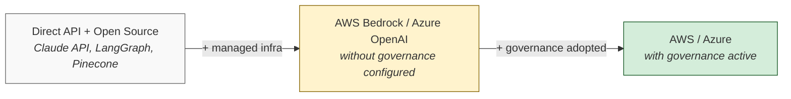
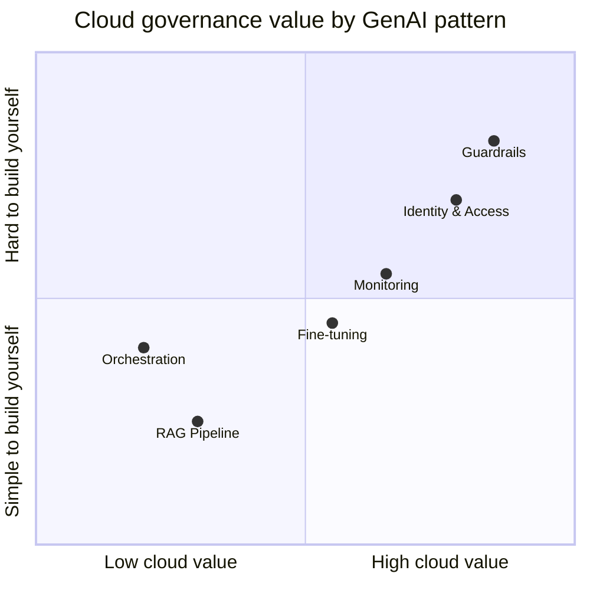

# AWS vs Azure AI Architecture Compared

An honest comparison of how AWS and Azure approach AI and GenAI architecture. Not a service mapping. A comparison of how each cloud thinks about building AI systems, what governance each platform adds, and when the enterprise wrapper is worth it.

> The value of a cloud AI platform is proportional to the governance you actually adopt. The middle box is where most teams are. This repo helps you decide if that is where you should be.

## Why This Exists

Most AWS-vs-Azure comparisons are shallow service mappings: "SageMaker = Azure ML, Bedrock = Azure OpenAI, done." That tells you nothing about which patterns to follow or why.

This project compares architectural thinking:
- What does each cloud recommend?
- Where do they agree?
- Where do they diverge?
- For each capability: is this genuinely new, or is it open-source with a managed wrapper and governance bolted on?

Open-source stacks (Claude API + LangGraph, OpenAI API + LangChain) are the baseline. The question is always: **what does the cloud platform add beyond what you could build yourself?**

## Who This Is For

- Cloud architects evaluating AI platforms for their organization
- Developers and ML engineers deciding whether to move from open-source stacks to cloud-managed services
- Anyone who wants honest trade-off analysis instead of marketing

## Where Cloud Adds Genuine Value (and Where It Doesn't)

> Guardrails and identity are where the cloud earns its cost. RAG and orchestration are well-served by open source. See [GenAI Patterns](dimensions/03-genai-patterns.md) for the full breakdown.

## Structure

This repo has two layers:

**Decision guide** (start here)
- [Decision Guide](guide/decision-guide.md) — "Do I need a cloud AI platform? If so, which one fits?"

**Dimension analysis** (deep dives)
- [Well-Architected Philosophy](dimensions/01-well-architected.md) — how each cloud structures architectural thinking and review
- [GenAI Architecture Patterns](dimensions/03-genai-patterns.md) — RAG, agents, fine-tuning, guardrails compared

**Quick reference**
- [Framework Comparison Table](tables/framework-comparison.md) — pillar-by-pillar WAF comparison

## How to Read This

Start with the [Decision Guide](guide/decision-guide.md) if you want the practical flow.

Jump to a dimension doc if you want depth on a specific topic.

Use the [Framework Comparison Table](tables/framework-comparison.md) as a quick reference.

## Per-Dimension Format

Every dimension doc follows the same structure:

1. **What does AWS recommend?** — grounded in actual docs, with source links
2. **What does Azure recommend?** — same treatment
3. **Where do they agree?** — convergence signals strong patterns
4. **Where do they diverge, and why?** — the most valuable section
5. **Honest take: genuine value vs. managed wrapper** — what governance does the cloud version add?
6. **Balance point** — at what organizational context is the cloud approach worth it?

## Versioning

Cloud guidance changes. Every document is date-stamped and notes which framework versions it references. If something looks outdated, check the date and open an issue.

## Status

This is a living resource. Current coverage:

| Dimension | Status |
|---|---|
| Well-Architected Philosophy | Complete |
| AI/ML Service Model | Planned |
| GenAI Architecture Patterns | Complete |
| MLOps / GenAIOps | Planned |
| Operating Model | Planned |
| Reference Architecture Style | Planned |

## License

MIT
