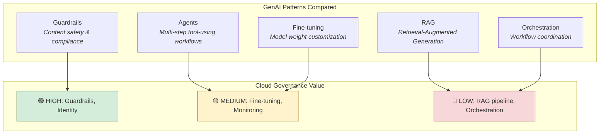
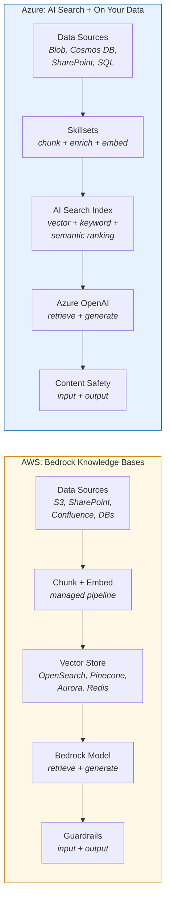
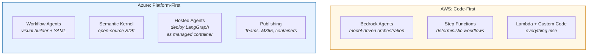

# Dimension 03: GenAI Architecture Patterns

**Last updated:** 2026-04-10
**Bedrock version/features noted:** Bedrock with 100+ foundation models (Claude Opus 4.6, Nova 2, DeepSeek V3.2, etc.); Knowledge Bases with multimodal RAG and agentic retrieval; Agents with action groups and multi-step orchestration; Guardrails with Standard tier code-aware filtering; Custom Models with supervised fine-tuning, reinforcement fine-tuning, and distillation.
**Azure OpenAI version/features noted:** Azure OpenAI with GPT-5.4/5.3/5.2/5.1/5 series, o-series reasoning models; Microsoft Foundry (formerly Azure AI Studio) with unified agent service; Azure AI Search with agentic retrieval (preview); Content Safety with task adherence API; Fine-tuning with SFT, DPO, and RFT methods.

## Pattern Overview

> For each pattern below: what does each cloud recommend, what is the open-source equivalent, and what governance does the cloud version actually add?

---

## Section 1: What does AWS recommend?

### RAG

AWS delivers managed RAG through Bedrock Knowledge Bases. The service handles the full ingestion pipeline: you point it at a data source (S3, web crawlers, Confluence, SharePoint, or structured databases), and it chunks documents, generates vector embeddings, and stores them in a vector store. You can bring your own vector store (OpenSearch Serverless, Pinecone, Redis Enterprise, or Amazon Aurora PostgreSQL) or let the service provision Amazon OpenSearch Serverless automatically. Chunking strategies, embedding model selection, and retrieval configuration are all exposed as parameters you control. The service also supports multimodal retrieval, extracting images from documents and making them searchable alongside text. ([Source: Bedrock Knowledge Bases](https://docs.aws.amazon.com/bedrock/latest/userguide/knowledge-base.html))

What makes this more than a vector database wrapper is the retrieval-and-generation coupling. When an application queries a Knowledge Base, Bedrock retrieves relevant chunks, optionally reranks them using a reranking model, and then augments the prompt sent to the foundation model. Citation generation is built in, so responses can reference which source documents contributed to the answer. For structured data sources, Knowledge Bases can convert natural language queries to SQL, which is a genuinely useful feature for enterprise data that lives in relational databases rather than document stores.

The GenAI Lens recommends RAG as the first customization strategy to try before fine-tuning, since it lets you ground model responses in proprietary data without modifying model weights. The lens specifically calls out optimizing vector stores and data retrieval performance as a cost and performance concern. The architectural pattern AWS recommends is: Knowledge Base for retrieval, Bedrock model for generation, and optionally Guardrails applied to both input and output. ([Source: AWS GenAI Lens](https://docs.aws.amazon.com/wellarchitected/latest/generative-ai-lens/generative-ai-lens.html))

### Agents

Bedrock Agents provide managed orchestration for multi-step, tool-using AI workflows. You define an agent with a foundation model, a set of instructions, and one or more action groups. Action groups are the mechanism for tool use: each group maps to a Lambda function or an API schema that the agent can invoke. When a user makes a request, the agent decomposes it into steps, decides which action groups to call, executes them, and synthesizes the result. The agent handles prompt engineering, memory management, monitoring, and encryption. ([Source: Bedrock Agents](https://docs.aws.amazon.com/bedrock/latest/userguide/agents.html))

What you configure is substantial. You can customize the prompt templates for four stages: pre-processing (input validation), orchestration (reasoning and planning), knowledge base response generation, and post-processing (output formatting). You can attach Knowledge Bases directly to agents, so an agent can retrieve information before or during its reasoning chain. Agents support versioning and aliases, so you can test via a draft alias and promote to production when ready. Traces show the step-by-step reasoning, which is critical for debugging multi-step workflows.

The architecture is composable but not drag-and-drop. You wire together Lambda functions, API schemas, and Knowledge Bases. AWS does not provide a visual orchestration builder for agents. The orchestration logic lives in the model's reasoning, guided by your instructions and prompt templates. This gives you fine-grained control but requires more upfront work than a no-code builder. For multi-agent workflows, you would build the coordination layer yourself, potentially using Step Functions to orchestrate multiple agents.

### Fine-tuning

Bedrock Custom Models supports three customization methods: supervised fine-tuning (labeled input-output pairs adjust model weights), reinforcement fine-tuning (reward functions defined via Lambda evaluate response quality), and distillation (a larger "teacher" model generates training data for a smaller "student" model). The distillation workflow is genuinely useful: you provide use-case-specific prompts, AWS generates responses from the teacher model, and fine-tunes the student model on those responses. This automates a process that teams otherwise build manually. ([Source: Bedrock Custom Models](https://docs.aws.amazon.com/bedrock/latest/userguide/custom-models.html))

Training costs are token-based (tokens processed times epochs), with per-month storage costs for the resulting model. The workflow is fully managed: you upload training data, configure the job, and AWS handles the compute. The set of models available for fine-tuning depends on what each provider has enabled on Bedrock. This is less open than running your own training on SageMaker, but significantly simpler.

### Guardrails

Bedrock Guardrails provide six categories of safeguards that you can configure independently: content filters (hate, insults, sexual, violence, misconduct, prompt attack), denied topics (custom topic definitions that block specific subjects), word filters (exact match on custom words, phrases, or a built-in profanity list), sensitive information filters (PII detection with block or mask actions, plus custom regex patterns), contextual grounding checks (detecting hallucinations by validating responses against source material), and automated reasoning checks (validating responses against logical rules). ([Source: Bedrock Guardrails](https://docs.aws.amazon.com/bedrock/latest/userguide/guardrails.html))

Each filter category has configurable thresholds. Content filters have adjustable strength per category. The Standard tier extends detection into code elements -- comments, variable names, string literals -- which matters for developer-facing applications. Guardrails support versioning (draft for iteration, stable versions for production) and include a built-in test window. You can customize the response message returned when a violation is detected.

The most architecturally significant feature is the ApplyGuardrail API, which can be invoked independently of any model call. This means you can use Bedrock Guardrails as a standalone content safety layer in front of any model, including models not hosted on Bedrock. You can also selectively tag which parts of the input to evaluate, so system instructions and few-shot examples are excluded from filtering while user input is screened. Guardrails integrate natively with Agents and Knowledge Bases.

### Orchestration

AWS does not prescribe a single orchestration framework. The recommended pattern is to use Bedrock Agents for model-driven orchestration (where the model decides what to do next) and Step Functions for deterministic workflow orchestration (where the flow is predefined). For custom orchestration beyond what Agents provide, AWS points to Lambda-based code. The GenAI Lens recommends optimizing agent workflows as a cost concern and distributing inference across regions for reliability. There is no visual prompt-flow builder equivalent to what Azure offers. AWS's philosophy is: orchestration is code, and the model is one component in that code. ([Source: AWS GenAI Lens](https://docs.aws.amazon.com/wellarchitected/latest/generative-ai-lens/generative-ai-lens.html))

**Sources:**
- [Amazon Bedrock Overview](https://docs.aws.amazon.com/bedrock/latest/userguide/what-is-bedrock.html)
- [Bedrock Knowledge Bases](https://docs.aws.amazon.com/bedrock/latest/userguide/knowledge-base.html)
- [Bedrock Agents](https://docs.aws.amazon.com/bedrock/latest/userguide/agents.html)
- [Bedrock Guardrails](https://docs.aws.amazon.com/bedrock/latest/userguide/guardrails.html)
- [Bedrock Custom Models](https://docs.aws.amazon.com/bedrock/latest/userguide/custom-models.html)
- [AWS Generative AI Lens](https://docs.aws.amazon.com/wellarchitected/latest/generative-ai-lens/generative-ai-lens.html)

### RAG Architecture: AWS vs Azure at a Glance

> Both follow the same pipeline stages. The difference: Bedrock Knowledge Bases is purpose-built for RAG. Azure AI Search is a mature search platform extended for RAG, which gives you more search features but more configuration decisions.

---

## Section 2: What does Azure recommend?

### RAG

Azure delivers RAG through Azure AI Search, a service that predates the GenAI wave and has been extended to support it. AI Search provides two retrieval engines: classic search (full-text, vector, hybrid, and multimodal queries against a single index) and agentic retrieval (a multi-query pipeline where an LLM decomposes queries into subqueries, retrieves from multiple knowledge sources in parallel, reranks, and merges results). Agentic retrieval is in public preview as of early 2026. ([Source: Azure AI Search](https://learn.microsoft.com/en-us/azure/search/search-what-is-azure-search))

The indexing pipeline handles chunking and vectorization through AI enrichment "skillsets." You connect data sources (Blob Storage, Cosmos DB, SharePoint, OneLake, SQL databases), and the service can chunk text, generate embeddings, and apply other transformations during ingestion. Vector search, hybrid search (combining keyword and vector), and semantic ranking are all built in. Document-level access control is supported, which matters for enterprise scenarios where different users should see different documents. The "On Your Data" feature in Azure OpenAI provides a simplified path: point Azure OpenAI at an Azure AI Search index, and the service handles retrieval and prompt augmentation automatically.

The key architectural difference from Bedrock Knowledge Bases is that Azure AI Search is a general-purpose search platform that has been extended for RAG, not a purpose-built RAG service. This means you get more search functionality (faceted navigation, filters, autocomplete, geo-spatial search) but also more configuration surface area. Setting up a well-tuned RAG pipeline on Azure involves more decisions: index schema design, skillset configuration, semantic ranker tuning, and query type selection. Microsoft Foundry provides a more guided path through its portal, but the underlying complexity remains.

### Agents

Microsoft Foundry Agent Service (formerly Azure AI Agent Service) is a fully managed platform for building, deploying, and scaling AI agents. It supports three agent types: prompt agents (configured through instructions and tools, no code required), workflow agents (multi-step orchestration with branching logic and human-in-the-loop steps, defined visually or in YAML), and hosted agents (code-based agents built with any framework, deployed as containers). Prompt agents are GA; workflow agents and hosted agents are in preview. ([Source: Microsoft Foundry Agent Service](https://learn.microsoft.com/en-us/azure/foundry/agents/overview))

The tool ecosystem is notable. Agent Service provides built-in tools (web search, file search, memory, code interpreter, MCP servers, custom functions) with managed authentication, including service-managed credentials and On-Behalf-Of authentication. A tool catalog with over 1,400 tools is accessible through the Foundry portal. Agents can have dedicated Microsoft Entra identities, enabling secure, scoped access to resources without shared credentials. Content filters are integrated to mitigate prompt injection and unsafe outputs. The service handles hosting, scaling, identity, observability (end-to-end tracing via Application Insights), and enterprise security.

The hosted agent type is the most interesting for teams with existing agent frameworks. You write orchestration logic in LangGraph, Agent Framework, or your own code, package it as a container, and deploy it to Agent Service. Foundry manages the runtime and scaling. This lets you use open-source orchestration while getting managed infrastructure, identity, and observability. For multi-agent coordination, workflow agents support sequential and group-chat patterns with visual or YAML-based definitions.

### Fine-tuning

Azure OpenAI supports three fine-tuning methods: supervised fine-tuning (SFT), direct preference optimization (DPO), and reinforcement fine-tuning (RFT). Supported models include GPT-4o, GPT-4o-mini, GPT-4.1 series (SFT and DPO), o4-mini (RFT), and open-source models like Llama, Qwen, and Mistral variants (SFT, in preview). Training data uses JSONL format with conversational structure. Minimum is 10 examples, but Microsoft recommends starting with 50 well-crafted examples and scaling to hundreds for meaningful improvement. ([Source: Azure OpenAI Fine-tuning](https://learn.microsoft.com/en-us/azure/ai-services/openai/how-to/fine-tuning))

The workflow is: upload training data (via SDK, REST API, or Blob Storage for files over 100MB), create a fine-tuning job with configurable hyperparameters (epochs, batch size, learning rate multiplier), monitor training metrics (loss, token accuracy), and deploy the resulting model. Three training tiers exist: Standard (data stays in region, higher cost), Global (data may move across regions, 20-40% savings), and Developer (cheapest, preemption allowed). Fine-tuned models incur hourly hosting costs while deployed, and inactive deployments are auto-deleted after 15 days. Continuous fine-tuning is supported -- you can fine-tune a previously fine-tuned model iteratively.

### Guardrails

Azure AI Content Safety is a standalone service that provides content filtering across multiple modalities. Core capabilities include: text and image analysis for hate, sexual content, violence, and self-harm with multi-severity levels; Prompt Shields that detect jailbreak attempts and user input attacks on LLMs; groundedness detection that validates LLM responses against source material (preview); protected material detection that flags known copyrighted text in AI outputs; custom categories that let you define and detect emerging harmful content patterns; and a task adherence API that detects when agent tool use is misaligned or premature. ([Source: Azure AI Content Safety](https://learn.microsoft.com/en-us/azure/ai-services/content-safety/overview))

Content Safety is both a standalone service and an integrated feature. When used with Azure OpenAI, content filtering is applied by default to every deployment. You can customize filter policies, adjust severity thresholds, and create custom blocklists through the Azure portal or API. The Content Safety Studio provides a web UI for testing, tuning, and monitoring content moderation performance, including business metrics like block rate and category proportions.

Two features stand out architecturally. Groundedness detection validates whether a model's response is grounded in provided source material, which directly addresses the hallucination problem in RAG applications. Protected material detection flags when an AI model reproduces known copyrighted content, which addresses a legal risk that most open-source guardrails frameworks do not handle. Both of these are hard to replicate with open-source tools because they require large-scale reference datasets that Microsoft maintains.

### Orchestration

Azure offers two primary orchestration paths. Semantic Kernel is an open-source SDK (C#, Python, Java) that serves as middleware between your application code and AI models. It provides a plugin model where existing APIs become tools that models can call, with built-in telemetry, filters, and hooks for enterprise observability. Semantic Kernel is not an Azure-only tool. It works with any model provider, but it is deeply integrated with Azure OpenAI and the Foundry ecosystem. ([Source: Semantic Kernel](https://learn.microsoft.com/en-us/semantic-kernel/overview/))

Microsoft Foundry provides a higher-level orchestration surface. Workflow agents allow visual or YAML-based definition of multi-step processes with branching logic and human-in-the-loop steps. The Foundry portal unifies agents, models, and tools under a single management surface with RBAC, networking, and policies. Publishing channels include Microsoft 365 Copilot, Teams, and containerized deployments. The platform has evolved rapidly: what was Azure AI Studio became Azure AI Foundry and is now Microsoft Foundry, consolidating Azure OpenAI, Azure AI Services, and agent capabilities under one resource provider. ([Source: Microsoft Foundry](https://learn.microsoft.com/en-us/azure/ai-studio/what-is-ai-studio))

**Sources:**
- [Azure OpenAI Service](https://learn.microsoft.com/en-us/azure/ai-services/openai/overview)
- [Azure AI Search](https://learn.microsoft.com/en-us/azure/search/search-what-is-azure-search)
- [Azure AI Content Safety](https://learn.microsoft.com/en-us/azure/ai-services/content-safety/overview)
- [Microsoft Foundry](https://learn.microsoft.com/en-us/azure/ai-studio/what-is-ai-studio)
- [Microsoft Foundry Agent Service](https://learn.microsoft.com/en-us/azure/ai-services/agents/overview)
- [Azure OpenAI Fine-tuning](https://learn.microsoft.com/en-us/azure/ai-services/openai/how-to/fine-tuning)
- [Semantic Kernel](https://learn.microsoft.com/en-us/semantic-kernel/overview/)

---

## Section 3: Where do they agree

Both clouds treat RAG as the default first step for grounding model responses in proprietary data. Neither recommends jumping straight to fine-tuning. AWS's GenAI Lens explicitly positions RAG before fine-tuning in the customization hierarchy. Azure's AI workload guidance treats grounding data as a primary design area.

Both provide managed vector storage, chunking, embedding generation, and retrieval as integrated pipeline steps. Both support hybrid search (combining keyword and vector retrieval) and reranking to improve retrieval quality. The convergence is strong: RAG is the pattern both clouds invest in most heavily.

Both clouds also converge on guardrails as a non-negotiable production requirement. Both provide content filtering that runs by default on model deployments, with configurable severity thresholds and custom policies. Both support PII detection, topic blocking, and prompt injection detection.

Both offer standalone APIs for their guardrails (Bedrock's ApplyGuardrail API, Azure's Content Safety REST API), meaning you can use them independently of the model hosting. And both are investing in hallucination detection: Bedrock through contextual grounding checks, Azure through groundedness detection.

When both clouds independently build the same capabilities with the same architectural pattern (configurable filters on input and output, with a standalone API), that is a strong signal this is the minimum viable safety architecture for production GenAI.

---

## Section 4: Where do they diverge, and why

**Purpose-built RAG service vs. extended search platform.** Bedrock Knowledge Bases is a service built specifically for RAG. You provide a data source, and it handles chunking, embedding, storage, retrieval, and generation in one managed pipeline.

Azure AI Search is a mature search platform (years older than the GenAI wave) that has been extended to support RAG through vector search, AI enrichment skillsets, and agentic retrieval.

The practical consequence: Bedrock gets you to a working RAG pipeline faster with fewer configuration decisions. Azure AI Search gives you more search capabilities (faceted navigation, geo-spatial queries, document-level security trimming) but requires more architectural decisions upfront. Azure reflects its enterprise search heritage. AWS reflects a bet that most teams need a retrieval pipeline, not a full search platform.

**Guardrails as a cross-cutting feature vs. a standalone service.** Bedrock Guardrails are a feature within the Bedrock ecosystem. You create a guardrail, attach it to a model, agent, or knowledge base, and it runs as part of the inference pipeline. The ApplyGuardrail API extends this to standalone use, but the primary pattern is "guardrail attached to a Bedrock resource."

Azure AI Content Safety is an independent service with its own resource, pricing tier, and API. It is integrated with Azure OpenAI (content filtering is on by default), but it also moderates content from any source, not just AI-generated content. Azure designed it this way because Content Safety serves a broader market: gaming, social platforms, and enterprise media, not just GenAI.

AWS's design is tighter and simpler for GenAI use cases. Azure's design is more flexible but introduces another service to manage.

**Orchestration philosophy: code-first vs. platform-first.**

AWS's orchestration story is intentionally minimal. Bedrock Agents handle model-driven orchestration. For everything else, you write code. There is no visual builder.

Azure invests heavily in platform-level orchestration: workflow agents with visual builders, Semantic Kernel as middleware, the Foundry portal as a unified management surface. Azure's hosted agents even let you deploy LangGraph code as a managed container.

The divergence reflects different philosophies about where orchestration logic should live. AWS says orchestration is your code. Azure says orchestration is a platform concern. Teams that prefer full control lean toward AWS. Teams that want a managed surface with built-in observability and publishing lean toward Azure.

---

## Section 5: Honest take: genuine value vs. managed wrapper

| Pattern | Cloud version | Open-source equivalent | What the cloud actually adds | Is it worth it? |
|---|---|---|---|---|
| RAG | Bedrock Knowledge Bases / Azure AI Search | LangChain + Pinecone (or Weaviate, Qdrant, pgvector) | Managed ingestion pipeline, automatic chunking and embedding, IAM/Entra integration for data source access, citation generation, audit logging. Azure adds document-level security trimming. | For a prototype: no. Direct API + vector DB is simpler and cheaper. For production with multiple data sources and compliance requirements: yes, the managed ingestion and access control earn their cost. Azure AI Search adds more value if you also need traditional search features. |
| Agents | Bedrock Agents / Foundry Agent Service | LangGraph, CrewAI, AutoGen | Managed hosting and scaling, built-in identity (Entra identities per agent), tool authentication, observability via CloudWatch/Application Insights, version management. Foundry adds 1,400+ pre-built tool connectors and publishing to Teams/M365. | For single-agent prototypes: no. LangGraph gives you better control and debuggability. For production agents that need enterprise identity, audit trails, and managed scaling: the cloud version reduces operational burden. Foundry's publishing channels to Teams/M365 are genuinely hard to replicate with open source. |
| Fine-tuning | Bedrock Custom Models / Azure OpenAI Fine-tuning | Direct API fine-tuning (OpenAI API), Hugging Face + your own compute | Managed training compute, hyperparameter configuration, model versioning, integrated deployment. Bedrock adds distillation (teacher-student automation). Azure adds training tiers with cost/residency trade-offs. | Almost always yes for hosted models. You are already paying for inference. The managed training pipeline adds minimal incremental cost over doing it yourself, and you avoid provisioning GPU compute. Bedrock's distillation feature is genuinely useful and hard to replicate. The value drops if you are fine-tuning open-source models where Hugging Face + your own cluster gives more control. |
| Guardrails | Bedrock Guardrails / Azure AI Content Safety | Guardrails AI, NVIDIA NeMo Guardrails, LLM Guard | Compliance-ready audit logging, managed policy versioning, integrated enforcement across the platform (not just one model), PII detection calibrated for regulatory categories. Azure adds protected material detection and groundedness detection. Bedrock adds automated reasoning checks. | This is where cloud adds the most genuine value. Guardrails AI and NeMo are good for basic content filtering, but they do not provide audit trails, compliance reporting, policy versioning, or PII detection calibrated against regulatory frameworks (HIPAA, PCI-DSS). For any regulated industry: cloud guardrails are worth it. Azure's protected material detection has no real open-source equivalent. |
| Orchestration | Step Functions + Lambda / Semantic Kernel + Foundry workflows | LangGraph, Prefect, Temporal, Apache Airflow | IAM/Entra-integrated execution, managed scaling, visual workflow builders (Azure only), built-in observability. Foundry adds publishing to M365/Teams. Step Functions add durable execution with exactly-once semantics. | The least differentiated pattern. LangGraph handles agent orchestration better than Step Functions or Prompt Flow for most GenAI-specific use cases. The cloud adds value for durable workflow execution (Step Functions) and enterprise publishing (Foundry), but the orchestration logic itself is better expressed in code. Use cloud infrastructure to run your orchestration code, not to replace it. |

**Analysis.**

Guardrails is where the cloud platform earns its cost most clearly. The difference between Guardrails AI running in your container and Bedrock Guardrails or Azure Content Safety in production is not the filtering quality. It is the governance layer: versioned policies, audit trails, compliance reporting, cross-service enforcement, and specialized detection capabilities (protected material, automated reasoning) that require datasets and infrastructure individual teams cannot maintain. If you are in a regulated industry, or if your legal team has opinions about AI-generated content, the cloud guardrails are not a luxury. They are the table stakes that let you ship.

RAG is where the cloud adds the least differentiation relative to open source. A LangChain pipeline with Pinecone or pgvector does the same retrieval job. The cloud managed service is convenient (one fewer thing to operate) but the retrieval quality depends on chunking strategy, embedding model choice, and prompt design, none of which the cloud makes better by default. Where the cloud RAG services genuinely help is access control (Azure AI Search's document-level security trimming, Bedrock's IAM integration with data sources) and multi-source ingestion (connecting to SharePoint, Confluence, or databases without writing custom connectors). If your data is already in S3 or Blob Storage and your access control requirements are simple, the open-source path is equally viable.

Agents sit in the middle. The orchestration logic itself (reasoning, planning, tool selection) depends entirely on the model and your instructions, not on whether you use Bedrock Agents or LangGraph. The cloud adds operational value: identity management, scaling, observability, and publishing. For a team of two building an internal tool, LangGraph is faster and more transparent. For an enterprise deploying customer-facing agents with audit requirements, the managed agent service reduces the surface area you need to secure and monitor yourself. The right answer depends on your operational maturity and compliance requirements, which is the thesis of this entire repo.

---

## Section 6: Balance point

| Your context | Recommendation |
|---|---|
| Building a prototype or POC | Direct API (Anthropic, OpenAI, or via Bedrock/Azure OpenAI) + LangGraph or LangChain for orchestration. Do not add cloud platform overhead. You need to iterate on prompts and architecture, not configure managed services. |
| Single-model, simple RAG app | The cloud RAG services work, but you are not using most of what they offer. A direct API call + pgvector or Pinecone + your own chunking pipeline may be simpler to debug and cheaper to run. Consider the cloud version only if you need to connect to enterprise data sources (SharePoint, Confluence) or need document-level access control. |
| Production app with compliance requirements | Cloud platform earns its cost here. Use Bedrock Guardrails or Azure Content Safety for content filtering with audit trails. Use the managed RAG pipeline for ingestion governance. Use IAM/Entra for access control. The governance layer is the product. |
| Complex multi-agent system | Use LangGraph or your own framework for orchestration logic. Deploy it on top of Bedrock or Azure OpenAI for the model calls, identity, and observability. On Azure, Foundry's hosted agents let you deploy LangGraph containers with managed infrastructure. On AWS, run your orchestration in ECS/EKS and call Bedrock for inference. Do not try to express complex agent coordination in Step Functions or Prompt Flow. |
| Multi-model strategy (using models from multiple providers) | Bedrock's model catalog (100+ models from Amazon, Anthropic, Meta, Mistral, and others) gives you a single API surface across providers. Azure is more concentrated around OpenAI models, though Foundry Models adds Cohere, DeepSeek, Llama, and others. If you need maximum model flexibility, Bedrock's breadth is an advantage. If your primary model is from OpenAI, Azure's deeper integration and more deployment options (provisioned throughput, batch, data zones) may matter more. Or go direct-to-API for each provider and handle routing yourself. |
| Enterprise already deep in Microsoft ecosystem | Azure has a structural advantage. Entra ID integration, Teams/M365 publishing for agents, SharePoint as a RAG data source, and Foundry's unified management surface all reduce integration friction. The open-source equivalent works but requires more glue code for identity and distribution. |

---

## Sources

1. Amazon Bedrock Overview: https://docs.aws.amazon.com/bedrock/latest/userguide/what-is-bedrock.html
2. Bedrock Knowledge Bases: https://docs.aws.amazon.com/bedrock/latest/userguide/knowledge-base.html
3. Bedrock Agents: https://docs.aws.amazon.com/bedrock/latest/userguide/agents.html
4. Bedrock Guardrails: https://docs.aws.amazon.com/bedrock/latest/userguide/guardrails.html
5. Bedrock Custom Models: https://docs.aws.amazon.com/bedrock/latest/userguide/custom-models.html
6. AWS Generative AI Lens: https://docs.aws.amazon.com/wellarchitected/latest/generative-ai-lens/generative-ai-lens.html
7. Azure OpenAI Service: https://learn.microsoft.com/en-us/azure/ai-services/openai/overview
8. Azure AI Search: https://learn.microsoft.com/en-us/azure/search/search-what-is-azure-search
9. Azure AI Content Safety: https://learn.microsoft.com/en-us/azure/ai-services/content-safety/overview
10. Microsoft Foundry (formerly Azure AI Studio): https://learn.microsoft.com/en-us/azure/ai-studio/what-is-ai-studio
11. Microsoft Foundry Agent Service: https://learn.microsoft.com/en-us/azure/ai-services/agents/overview
12. Azure OpenAI Fine-tuning: https://learn.microsoft.com/en-us/azure/ai-services/openai/how-to/fine-tuning
13. Semantic Kernel: https://learn.microsoft.com/en-us/semantic-kernel/overview/
